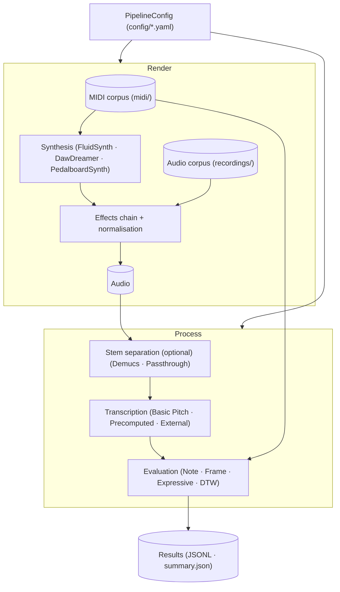
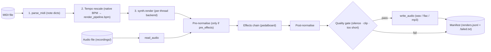
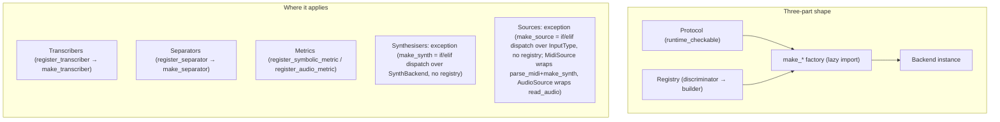
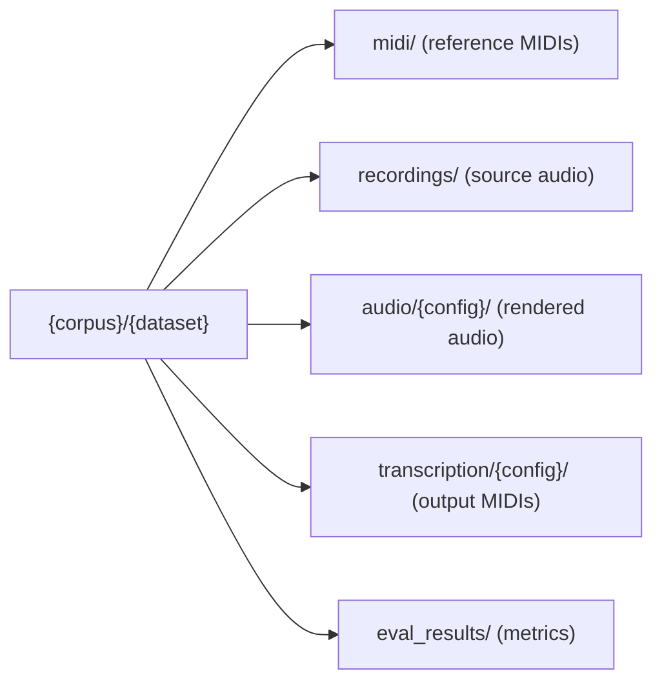
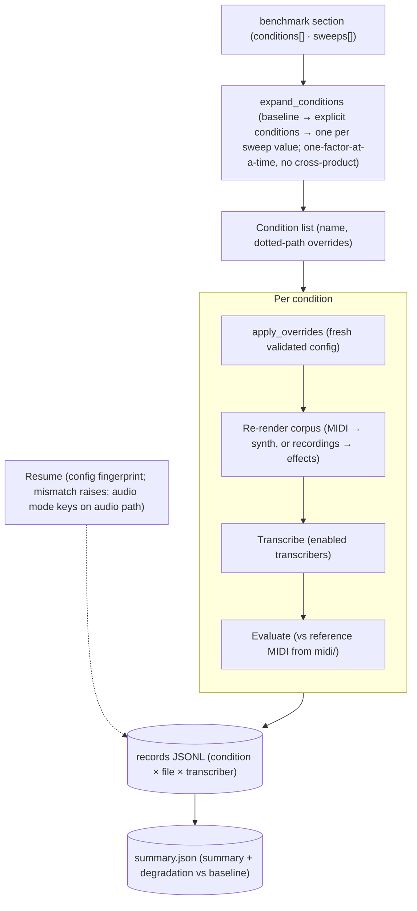
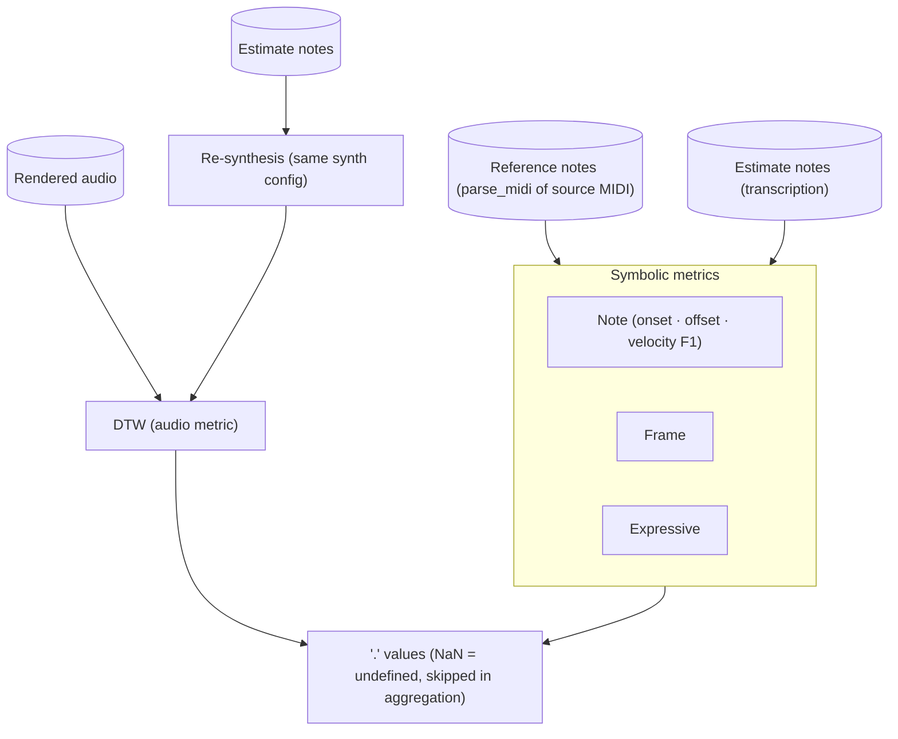
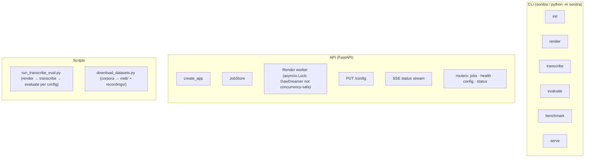
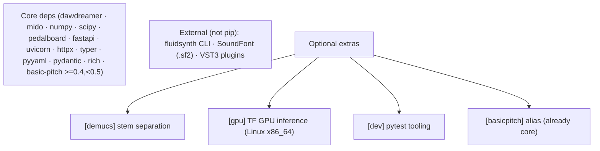
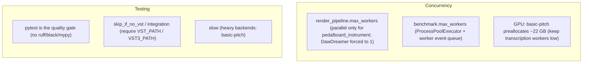

# Architecture

## System overview

`render_pipeline.input_type: midi | audio` selects the render input: MIDI renders via synthesis, audio reads the source recording directly (synth skipped). Evaluation always uses the reference MIDIs in `midi/`.

## Render path (per file)

In audio mode the synth stage is skipped: `read_audio` replaces `parse_midi` → tempo rescale → `synth.render`. Audio-mode manifest entries record `source_path` (the source recording) alongside the usual fields.

## Pluggable-backend idiom

## Configuration

```mermaid
flowchart TB
    cfg["PipelineConfig (extra='forbid' everywhere)"]
    p["pipeline (synth_backend · effects_chain · input_type · bpm · sample_rate · max_workers)"]
    io["io (corpus_root · output_format · file_naming · dataset)"]
    dd["dawdreamer (block_size · plugin_path · faust_code)"]
    fs["fluidsynth (soundfont_path)"]
    pb["pedalboard (instrument · effects[])"]
    norm["normalisation (enabled · mode peak/rms · target_db · pre_effects)"]
    qg["quality_gates (silence · min_duration · clip)"]
    obs["observability (manifest · sse · progress)"]
    sep["separation (enabled · backend · model)"]
    tx["transcription (transcribers[] · max_workers)"]
    ev["evaluation (note · frame · expressive · dtw)"]
    bm["benchmark (conditions[] · sweeps[] · resume · max_workers)"]

    cfg --> p & io & dd & fs & pb & norm & qg & obs & sep & tx & ev & bm
```

Validators: `synth_backend=fluidsynth` requires `fluidsynth.soundfont_path`; `dawdreamer_vst` requires `dawdreamer.plugin_path`; `dawdreamer_faust` must not set it. These apply in MIDI mode only; with `render_pipeline.input_type: audio` the synth is never used, so the backend-field requirements are skipped. `validate_worker_constraint()` forces `max_workers=1` for DawDreamer `synth_backend`s regardless of `input_type` — it keys purely on `synth_backend`, so it still applies (harmlessly, since the synth is unused) if a DawDreamer backend is left configured in an audio-mode config.

### Corpus layout

`midi/` and `recordings/` are read-only sources; everything the pipeline writes lives under the work dir (`audio/{config}/`, `transcription/{config}/`, `eval_results/`). Audio files pair to reference MIDIs by token-prefix match (e.g. `BSED-01_1_*.wav` → `BSED-01_*.mid`) via `sonitra.corpus.pair_audio_to_reference` (top-down k-descent over `_`-split filename tokens; ambiguous or unmatched recordings are excluded, logged, and reported in `PairingResult`). `sonitra.corpus.discover_midi_files` / `discover_audio_files` do the recursive directory walks.

## Benchmark orchestration

In audio mode the corpus recordings are the inputs, paired to reference MIDIs in `midi/`; DTW is skipped since real recordings cannot be compared against synth re-synthesis. Conditions/sweeps may not override `render_pipeline.input_type` (`_validate_no_input_type_sweep`, checked unconditionally before expansion) — input mode selects the corpus/pairing for the whole run and cannot vary per condition.

## Evaluation

DTW compares rendered audio against a re-synthesis of the transcription; it is skipped for audio input (real recordings).

## Interfaces

`render` and `benchmark` read `render_pipeline.input_type` to select MIDI vs audio sources; `transcribe` and `evaluate` already accept `--audio` / `--reference` / `--estimate` path overrides. `--corpus` is asymmetric between the two commands: for `render` it means the recordings dir in audio mode (defaulting to `paths.recordings`), for `benchmark` it always means the reference-MIDI dir — recordings there come from `paths.recordings` unconditionally.

## Dependencies

GPU: set `device: GPU:0` on a `basic_pitch` transcriber (default `cpu`). Docker GPU passthrough is a Compose profile (`--profile gpu`, service `sonitra-gpu`).

## Concurrency & testing

Audio mode never touches the synth, so it parallelises freely regardless of `synth_backend`.