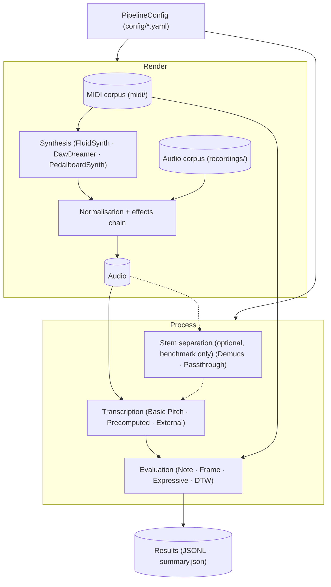
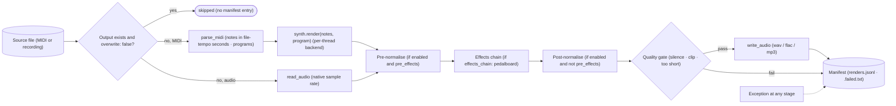
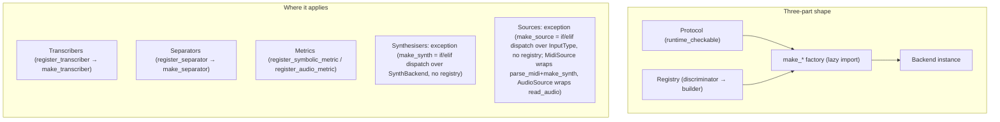
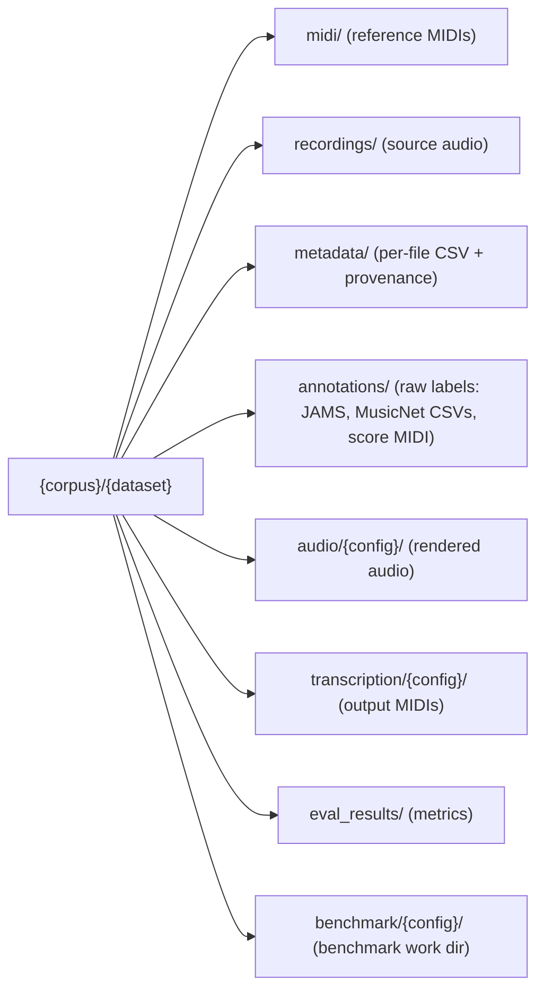
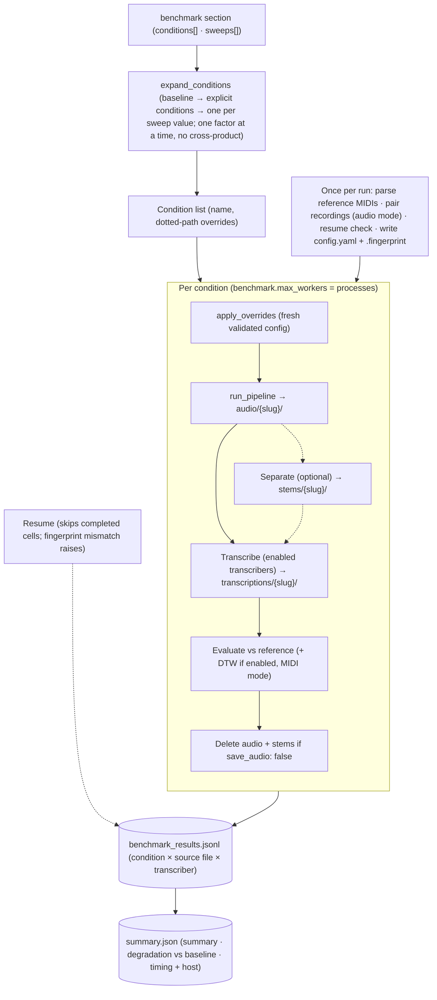
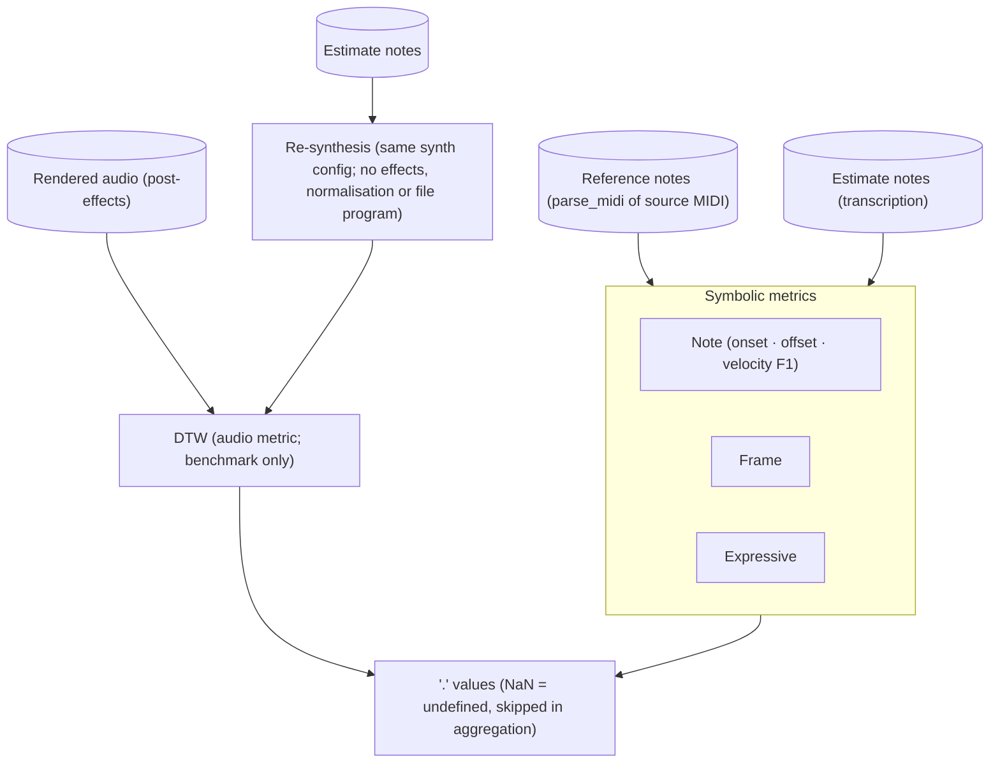
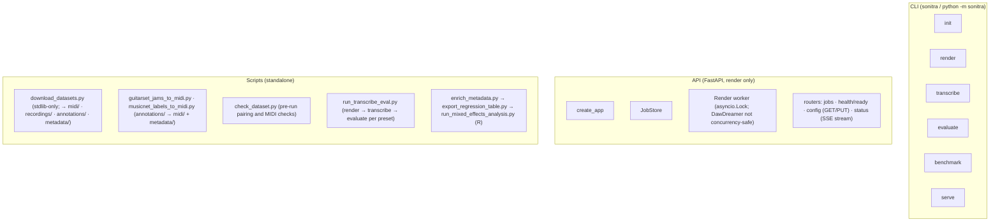
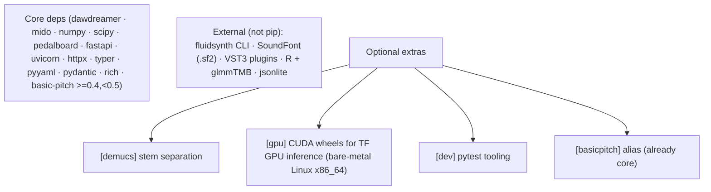
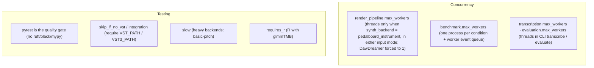

# Architecture

## System overview

`render_pipeline.input_type: midi | audio` selects the render input: MIDI renders via synthesis, audio reads the source recording directly (synth skipped). Evaluation always uses the reference MIDIs in `midi/`. Stem separation and DTW run only inside `sonitra benchmark`; the standalone `transcribe` / `evaluate` commands skip them.

## Render path (per file)

- **Tempo**: notes follow the MIDI file's own tempo map; `render_pipeline.bpm` is host tempo only (DawDreamer `set_bpm`, FluidSynth tick grid).
- **Program**: a file with exactly one program passes it to the synth; several programs pass none (warned once). FluidSynth uses `fluidsynth.program` if set, else the file program, else the SoundFont default; DawDreamer and Pedalboard ignore it.
- **Normalisation** runs at most once per file: before effects if `pre_effects`, otherwise after.
- **Fail-soft**: gate failures and exceptions are recorded and the batch continues. The effects chain is built before the loop, so a chain that fails to load aborts the batch.
- **Manifest** is opt-in (`observability.write_manifest`, `write_failed_list`). Audio-mode entries record `source_path` (the recording) alongside the usual fields.

## Pluggable-backend idiom

## Configuration

```mermaid
flowchart TB
    cfg["PipelineConfig (extra='forbid' everywhere)"]
    p["render_pipeline (input_type · synth_backend · effects_chain · bpm = host tempo · overwrite · max_workers)"]
    io["io (corpus_root · dataset · output_format)"]
    dd["dawdreamer (plugin_path · faust_code)"]
    fs["fluidsynth (soundfont_path · program)"]
    pb["pedalboard (instrument · effects[])"]
    norm["normalisation (enabled · pre_effects)"]
    qg["quality_gates (silence · clip · min_duration)"]
    obs["observability (write_manifest · write_failed_list)"]
    sep["separation (enabled · backend · stem)"]
    tx["transcription (transcribers[] · max_workers)"]
    ev["evaluation (note · frame · expressive · dtw · max_workers)"]
    bm["benchmark (conditions[] · sweeps[] · resume · save_audio · max_workers)"]

    cfg --> p & io & dd & fs & pb & norm & qg & obs & sep & tx & ev & bm
```

Only behaviour-driving fields are shown; `config/source.yaml` documents every key.

Validators apply in MIDI mode only (audio mode never builds a synth): `synth_backend=fluidsynth` requires `fluidsynth.soundfont_path`; `dawdreamer_vst` requires `dawdreamer.plugin_path`; `dawdreamer_faust` must not set it. `validate_worker_constraint()` keys only on `synth_backend`, so a DawDreamer backend forces `render_pipeline.max_workers=1` in either mode.

### Corpus layout

`midi/`, `recordings/`, `metadata/` and `annotations/` are produced by `scripts/download_datasets.py` (which also keeps download records in `.sources/`) and the dataset converters; the pipeline only reads them. The CLI writes `audio/{config}/`, `transcription/{config}/` and `eval_results/`; `sonitra benchmark --dataset` writes `benchmark/{config}/` (`./benchmark/{config}/` without `--dataset`).

Recordings pair to reference MIDIs by token prefix (e.g. `BSED-01_1_*.wav` → `BSED-01_*.mid`) via `sonitra.corpus.pair_audio_to_reference`: `k` descends over `_`-split stem tokens and stops at the first `k` with one candidate (paired) or several (ambiguous). Unmatched and ambiguous recordings are excluded, logged and reported in `PairingResult` (`ambiguous` keeps their candidates). `scripts/check_dataset.py` calls the same function; its core, `match_token_prefix`, also backs `export_regression_table.py --metadata-match token-prefix`. `discover_midi_files` / `discover_audio_files` do the recursive directory walks.

## Benchmark orchestration

A failed render yields `render_failed` records for that file and the run continues. In audio mode the recordings are the inputs, paired once to reference MIDIs in `midi/`, and records key on the recording path; DTW is skipped. Conditions/sweeps may not override `render_pipeline.input_type` (`_validate_no_input_type_sweep`, checked before expansion): input mode selects the corpus and pairing for the whole run.

## Evaluation

DTW runs only in `sonitra benchmark`, in MIDI mode, when `evaluation.dtw.enabled` (off by default). Its re-synthesis skips the effects chain, normalisation and the file's program, so the distance also reflects those differences, not only transcription error.

## Interfaces

`render` and `benchmark` read `render_pipeline.input_type` to select MIDI vs audio sources; `transcribe` and `evaluate` accept `--audio` / `--reference` / `--estimate` path overrides. `--corpus` differs between the two: for `render` it is the recordings dir in audio mode (default `paths.recordings`); for `benchmark` it is always the reference-MIDI dir, and recordings always come from `paths.recordings`. API jobs without a config fall back to the legacy `engine=` render path. `sonitra.midi_writer` is shared by transcription output and the converters; `sonitra.unisons` by the converters.

## Dependencies

GPU: set `device: GPU:0` on a `basic_pitch` transcriber (default `cpu`). Docker GPU passthrough is a Compose profile (`--profile gpu`, service `sonitra-gpu`; the GPU image installs CUDA itself rather than using the extra).

## Concurrency & testing

Render parallelism keys only on `synth_backend`, so audio mode renders serially unless `synth_backend: pedalboard_instrument`.
