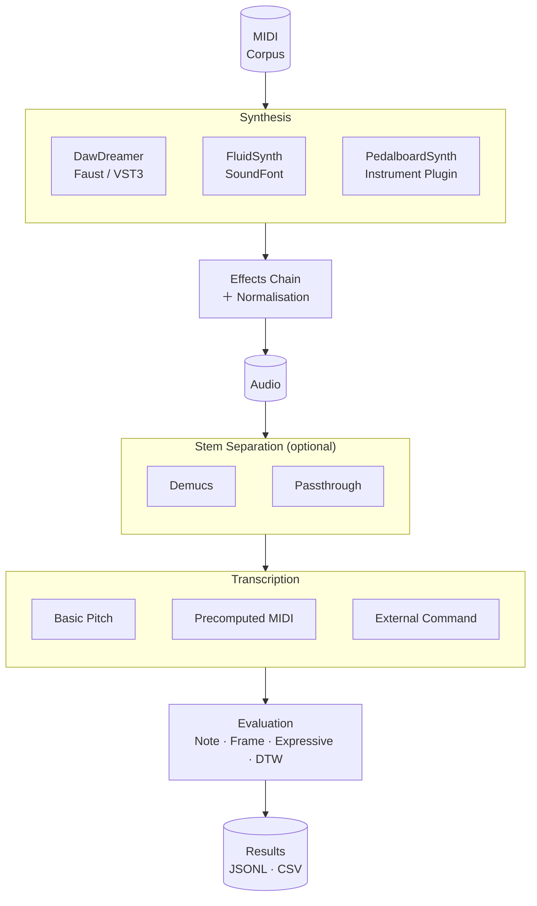

## Architecture

```mermaid
flowchart TB
    corpus[("MIDI\nCorpus")]

    subgraph synth["Synthesis"]
        direction TB
        dd["DawDreamer\nFaust / VST3"]
        fs["FluidSynth\nSoundFont"]
        pb["PedalboardSynth\nInstrument Plugin"]
    end

    fx["Effects Chain\n＋ Normalisation"]
    audio[("Audio")]

    subgraph sep["Stem Separation (optional)"]
        direction TB
        demucs["Demucs"]
        passthrough["Passthrough"]
    end

    subgraph tx["Transcription"]
        direction TB
        bp["Basic Pitch"]
        pre["Precomputed MIDI"]
        ext["External Command"]
    end

    eval["Evaluation\nNote · Frame · Expressive · DTW"]
    results[("Results\nJSONL · CSV")]

    corpus --> synth
    synth --> fx
    fx --> audio
    audio --> sep
    sep --> tx
    tx --> eval
    eval --> results
```
